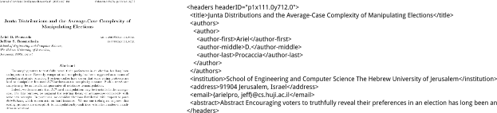
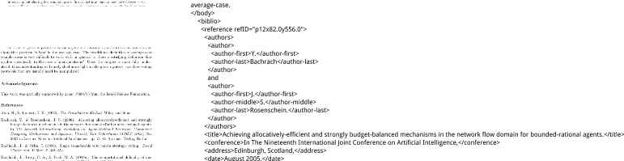

### Rexa metatagger: scientific paper header and reference extraction.

Metatagger is a system which consumes the output of the Rexa's
[pstotext](https://github.com/iesl/rexa1-pstotext) tool and produces an annotated version of the
text, finishing by writing the results to an XML file. The system is a structured series of pipelined
components, each performing some task, such as layout analysis (e.g., header block, abstract,
body text), or finer-grained labelling, such as identifying reference fields.

The stablest and most mature pipeline components are the coarse segementation system, the
header field labeller, and the reference field labeller. Other components which are in various
states of development include an "acknowledgements" section labeller, grant number/granting
institution labeller, and citations-in-context identification (i.e., identifying the points in the
document where the reference markers appear).

Header fields include: 

   + title
   + authors, author, author-first, author-middle, author-last
   + institution
   + address
   + email
   + abstract

- - - 

Body fields include: 

   + section-marker
   + paragraph-marker
   + notext
   + figure-marker
   + table-marker

- - - 

Reference fields include:

   + address
   + author, author-first, author-last, authors
   + conference
   + date
   + journal
   + note
   + pages
   + publisher
   + reference
   + ref-marker
   + series
   + title
   + volume
   + web

- - - 

Each reference XML tag is given the following attributes to help identify where the 
element was found within the original PDF file: 

   + pageNum - page number element was found on
   + llx, lly, urx, ury - coordinates of the rectangle it was found in

- - -

Some reference XML tags are given the following attributes: 

   + id

### Compiling

    $prompt> ./sbt compile

### Running

Basic usage: cat input-file-list | bin/runcrf

The wrapper script *runcrf* expects a list of input and output filename pairs, one per line,
like so:

    /path/to/input/file.xml -> /path/to/output/file.output.xml

An example file might look like this:

	pstotext-samples/0036C69A8021179B87B8703EE912685CE9DF6606.pdf.pstotext.xml -> pstotext-samples/0036C69A8021179B87B8703EE912685CE9DF6606.pdf.pstotext.xml.tagged.xml
	pstotext-samples/003E74C5D7BA741455E5F4659D9BBF4F7240BCF6.pdf.pstotext.xml -> pstotext-samples/003E74C5D7BA741455E5F4659D9BBF4F7240BCF6.pdf.pstotext.xml.tagged.xml
	pstotext-samples/0035A6C7E94004CE1FF6FA8BE4A64B57D69C9791.ps.pstotext.xml -> pstotext-samples/0035A6C7E94004CE1FF6FA8BE4A64B57D69C9791.ps.pstotext.xml.tagged.xml

Here's how to run it:

    $prompt> cat file.txt | bin/runcrf

A method to run a single file:
	
	$prompt> echo "pstotext-samples/0036C69A8021179B87B8703EE912685CE9DF6606.pdf.pstotext.xml -> pstotext-samples/0036C69A8021179B87B8703EE912685CE9DF6606.pdf.pstotext.xml.tagged.xml" | bin/runcrf

